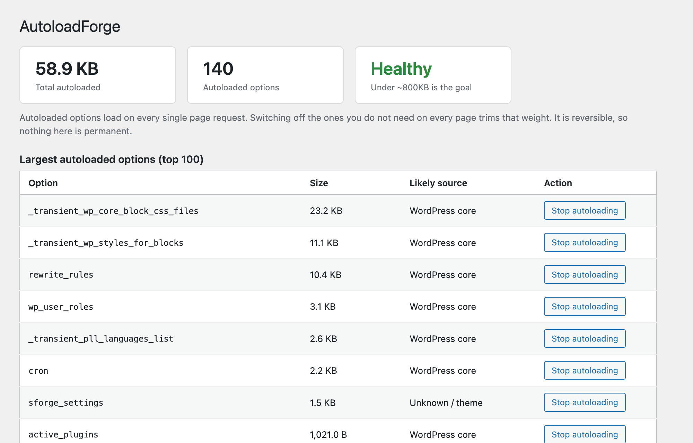

# ⚒️ AutoloadForge

### Find what's bloating your autoloaded options — and trim it, safely. ✂️

One Tools screen that shows the weight, names the likely culprit, and switches autoload off without deleting a thing.

---

## 🩺 The problem

Every WordPress request loads your autoloaded options together, in one query, before anything else runs. Plugins keep adding to that pile, and plenty of it doesn't need to be there on every page. Let it grow into the megabytes and the whole site carries the weight on each load.

Most fixes mean opening phpMyAdmin and running raw SQL against `wp_options`, which is exactly where people get nervous. AutoloadForge keeps it inside wp-admin and keeps it reversible.

## 📦 What you get

| | |
|---|---|
| 📊 **The number** | Total autoloaded size and how many options make it up, with a health status (healthy → getting heavy → too heavy). |
| 🐷 **The offenders** | Your largest autoloaded options, biggest first. |
| 🔍 **The culprit** | A best-effort match of each option to the plugin that likely created it. |
| ⚡ **The fix** | One click to stop an option autoloading. It stays in the database, it just stops loading on every request. |
| ↩️ **The undo** | A list of everything you've switched off, each with a restore button. |

## 🛡️ Why it's safe

> [!TIP]
> **AutoloadForge never deletes an option.** Switching autoload off changes one flag: whether WordPress loads that option automatically on every page. The data stays put and fully intact — if something turns out to need it, WordPress still reads it on demand, and you can restore autoloading from the same screen.

That's the deliberate difference from "one-click database cleaner" plugins. Nothing here is destructive, so nothing here is a gamble.

## ⚙️ Installation

**From your dashboard**

1. Download this repository as a ZIP.
2. **Plugins → Add New → Upload Plugin**, pick the ZIP, install and activate.

**Manually**

1. Copy the `autoloadforge` folder into `wp-content/plugins/`.
2. Activate **AutoloadForge**.

Then open **Tools → AutoloadForge**.

## 🚀 How to use it

1. Open **Tools → AutoloadForge**. The cards up top tell you the total autoloaded size and whether it's in a good range.
2. Scan the largest-options table. The "Likely source" column tells you which plugin most rows belong to.
3. For anything you know doesn't need to load on every page, click **Stop autoloading**.
4. Changed your mind, or something needs it back? Find it under **Switched off by AutoloadForge** and click **Restore autoloading**.

## 📸 Screenshot

## ✅ Requirements

> [!NOTE]
> - WordPress 6.4 or newer (uses the core autoload API added in 6.4)
> - PHP 7.4 or newer

## 💛 Support

Find it useful? You can [buy me a coffee on Ko-fi](https://ko-fi.com/gunjanjaswal).

Bug or idea? Open an issue, or email [hello@gunjanjaswal.me](mailto:hello@gunjanjaswal.me).

## 👤 Author

**Gunjan Jaswal**

- 🌐 Website: [gunjanjaswal.me](https://www.gunjanjaswal.me)
- ✉️ Email: [hello@gunjanjaswal.me](mailto:hello@gunjanjaswal.me)
- ☕ Ko-fi: [ko-fi.com/gunjanjaswal](https://ko-fi.com/gunjanjaswal)

## 📄 License

Released under the [GPLv2 or later](https://www.gnu.org/licenses/gpl-2.0.html).
